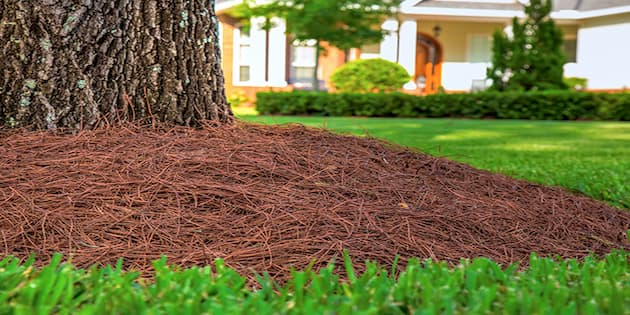

{fig-alt="Pine straw mulch" width="100%"}

## Who we are
Pinestraw Distributors LLC is your trusted connection to the finest pine straw mulch
  harvested from the longleaf and slash pine forests of northern Florida and southern Georgia.
   With over 25 years of experience in the market, we have built the relationships, the
  knowledge, and the reach to source premium-grade pine straw and deliver it to buyers who
  demand quality.

## Why pinestraw?

  Unlike wood chip or bark mulches that break down quickly and require
  frequent replacement, pine straw holds its structure season after season, maintaining a
  clean, finished appearance with minimal upkeep. As a product native to the southern
  landscape, pine straw integrates naturally into local ecosystems, supporting soil health
  without introducing foreign materials. It is 100% natural, chemical-free, and has the added
  benefit of repelling common insects — making it the smart, sustainable choice for
  residential landscapes, commercial properties, and large-scale agricultural applications.
  When you choose Pinestraw Distributors LLC, you're choosing a mulch that works as hard as
  the land it comes from.

```{=html}
<blockquote class="psd-testimonial">
  <p>"We had huge pine straw demands and Pine Straw Distributors delivered quality straw on time at a market-beating price from others."</p>
  <footer>— John Smith</footer>
</blockquote>
```

## How We Deliver

Pine straw is available in three formats to match any job size, from a single residential
yard to a large-scale commercial project. We work with you to determine the right format
for your volume, equipment, and timeline.

### Standard Bales

Individual hand-tied bales are the most common format for residential landscapers and
smaller commercial accounts. Lightweight and easy to handle, standard bales can be
distributed by hand without any special equipment. They are ideal for detailed landscape
beds, tight spaces, and customers who prefer to apply mulch themselves or in small crews.

### Palletized Bales

For larger orders, bales are stacked and strapped on pallets for efficient transport and
handling. Palletized delivery is the preferred format for nurseries, landscape supply
companies, and commercial contractors who move volume regularly. Pallets can be offloaded
with a forklift or pallet jack, reducing labor and turnaround time on large jobs.

### Round Big Bales

Round big bales offer maximum volume for large-scale applications such as highway
landscaping, golf courses, farms, and municipal projects. These bulk bales are loaded and
unloaded with tractor equipment and represent the most cost-effective per-unit price for
buyers with the capacity to handle them. Contact us to discuss availability and minimum
order quantities.
