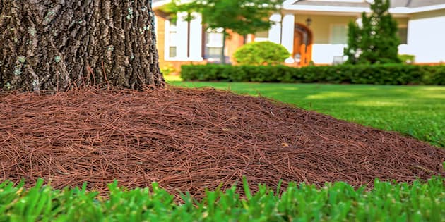

{fig-alt="Close-up of golden pine straw mulch spread across a garden bed" width="100%"}

For more than three decades, Pine Straw Distributors LLC has supplied high-quality,
all-natural pine straw to landscapers, golf courses, nurseries, contractors, and
retailers across the United States. Based in Florida and led by seasoned industry
experts, we specialize in longleaf and slash pine straw sourced from the premium
forests of North Florida and South Georgia. We are a trusted national distributor
known for reliability, consistency, and exceptional customer service.

## Why Choose Pine Straw Distributors LLC?

- **30+ years of industry expertise**
- **Premium longleaf & slash pine straw** — clean, fresh, and long-lasting
- **Sourced from top producers** in North Florida & South Georgia
- **Nationwide shipping** with dependable logistics
- **Wholesale-only** — built for landscapers, golf courses, nurseries, contractors, and retailers
- **Flexible truckload options** to match your business needs

## Our Products

::: {.grid}
::: {.g-col-12 .g-col-md-6}
### Longleaf Pine Straw

Longer needles for a premium, high-end look and excellent erosion control.
Popular for upscale commercial and residential properties, golf courses, and
retail resale.
:::

::: {.g-col-12 .g-col-md-6}
### Slash Pine Straw

A cost-efficient choice for large-scale landscaping with the same excellent
erosion control. A favorite with contractors and municipalities.
:::
:::

## Shipping & Truckloads

We offer two wholesale shipping formats, palletized and floor-loaded, to match your operational needs, with
nationwide delivery coordinated by our logistics team. Whether you're on the East Coast, West Coast, Midwest, or the Gulf, we ship
directly to your location. By partnering with trusted carriers, we ensure
on-time delivery, secure loads, and clear communication from order to arrival.

::: {.grid}
::: {.g-col-12 .g-col-md-6}
### Palletized

**1,344 bales per truckload.** Easy to unload and ideal for retail garden
centers, nurseries, and organized storage.
:::

::: {.g-col-12 .g-col-md-6}
### Floor-Loaded

**1,540 bales per truckload**, with half truckloads available. Best for
high-volume landscapers and distributors.
:::
:::

## Who We Serve

::: {.psd-two-col}
- Landscape supply companies
- Garden centers & nurseries
- Golf courses
- Commercial landscapers
- Municipalities & HOAs
- Retailers
- Large property management groups
- National distributors
:::

## Request a Quote

::: {.callout-note appearance="simple" icon="false"}
### Ready to order or get pricing?

Whether you need a single truckload or recurring shipments, we'll build a
customized quote based on your location and preferred truckload type.

**Email:** [sales@pinestrawdistributors.com](mailto:sales@pinestrawdistributors.com)
**Phone:** 1-800-xxx-xxxx
:::

Pine Straw Distributors LLC has grown into one of the most trusted wholesale
pine straw suppliers in the country. Our mission is simple: deliver premium pine
straw with exceptional service, on time.
